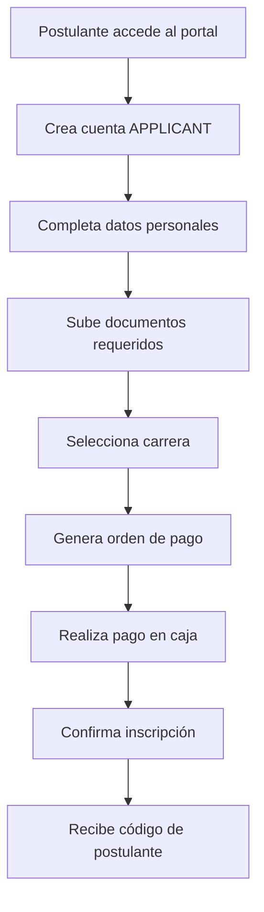
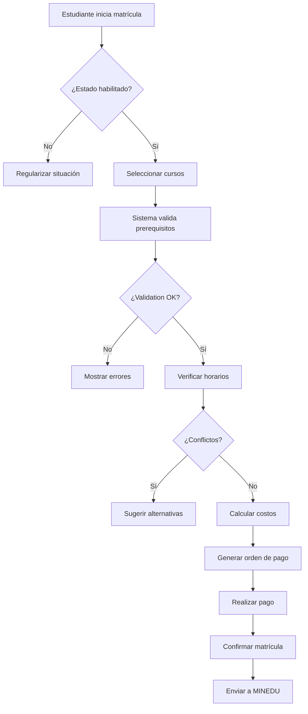
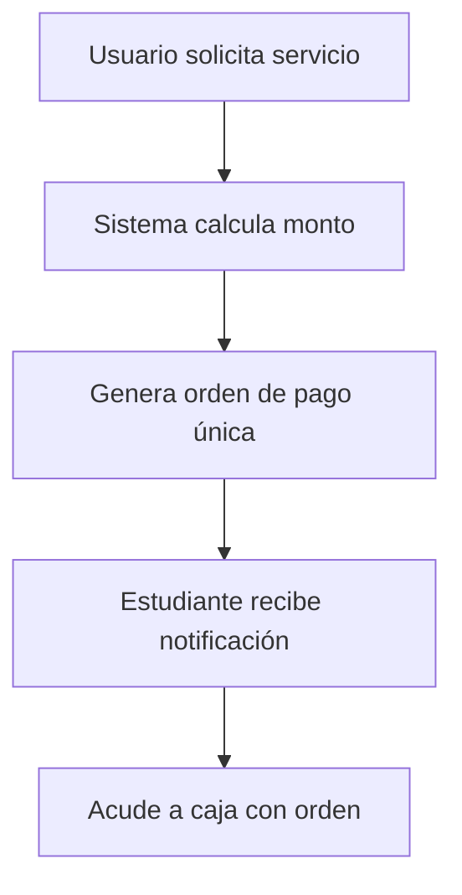
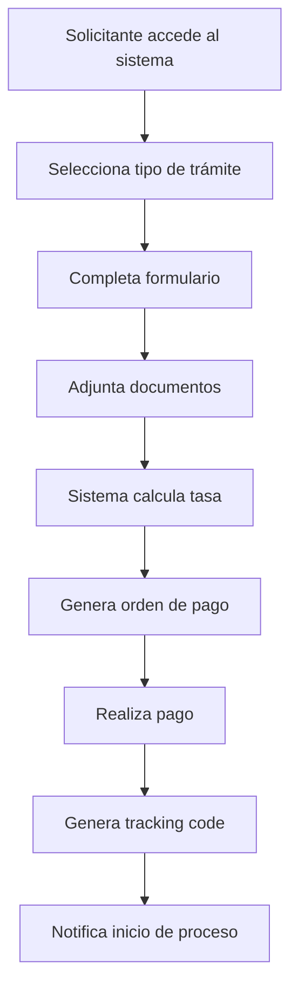
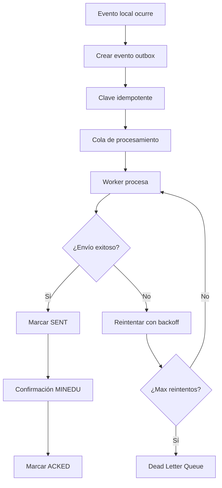
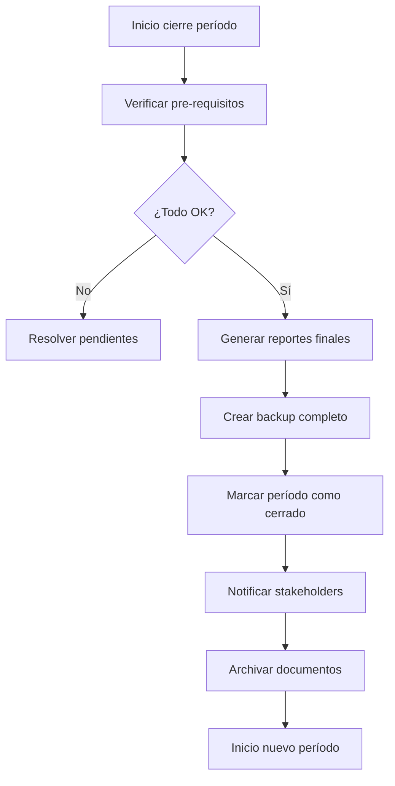
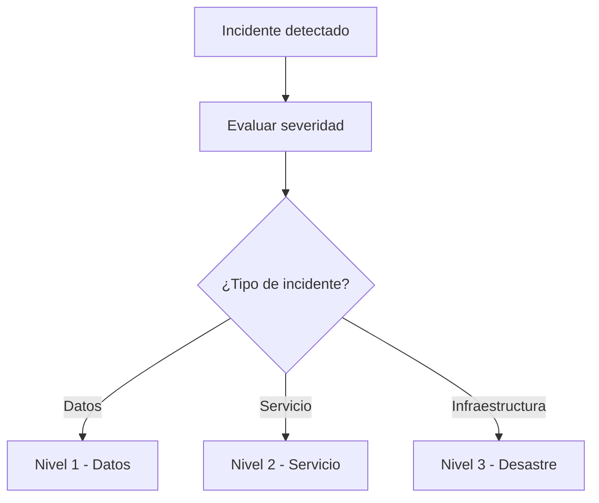

# Guía de Procesos - Sistema Académico Integral

## Tabla de Contenidos

1. [Proceso de Admisión](#proceso-de-admisión)
2. [Proceso de Matrícula](#proceso-de-matrícula)
3. [Proceso de Pagos](#proceso-de-pagos)
4. [Proceso de Trámites Digitales](#proceso-de-trámites-digitales)
5. [Proceso de Calificaciones y Actas](#proceso-de-calificaciones-y-actas)
6. [Proceso de Integración MINEDU](#proceso-de-integración-minedu)
7. [Proceso de Cierre de Período](#proceso-de-cierre-de-período)
8. [Procesos de Respaldo y Recuperación](#procesos-de-respaldo-y-recuperación)

---

## Proceso de Admisión

### 🎯 **Objetivo**
Gestionar el proceso completo de admisión desde la convocatoria hasta la inscripción de nuevos estudiantes.

### 👥 **Actores Involucrados**
- **Postulante**: Persona que desea ingresar
- **Personal de Admisión**: Gestiona proceso
- **Cajero**: Recibe pagos
- **ADMIN_ACADEMIC**: Aprueba y configura

### 📋 **Flujo del Proceso**

#### **Fase 1: Convocatoria**
1. **ADMIN_ACADEMIC** crea nueva convocatoria:
   - Define fechas de proceso
   - Establece carreras disponibles
   - Configura número de vacantes
   - Publica requisitos

2. **Publicación**:
   - Portal web institucional
   - Redes sociales
   - Medios locales

#### **Fase 2: Inscripción de Postulantes**


**Documentos Requeridos**:
- ✅ Partida de nacimiento
- ✅ Certificado de estudios secundarios
- ✅ DNI escaneado
- ✅ Foto tamaño carnet
- ✅ Certificado médico
- ✅ Constancia de no antecedentes

#### **Fase 3: Evaluación**
1. **Examen de Admisión**:
   - Fecha programada en convocatoria
   - Evaluación por competencias
   - Registro de notas en sistema

2. **Evaluación de Documentos**:
   - Verificación de autenticidad
   - Validación de requisitos
   - Entrevista personal (si aplica)

#### **Fase 4: Publicación de Resultados**
1. **Cálculo de Puntajes**:
   - Nota de examen (70%)
   - Promedio de secundaria (20%)
   - Evaluación personal (10%)

2. **Lista de Ingresantes**:
   - Publicación en portal web
   - Notificación por email/SMS
   - Generación de constancia

#### **Fase 5: Matrícula de Ingresantes**
1. **Confirmación de Ingreso**:
   - Plazo: 3 días hábiles
   - Pago de matrícula
   - Presentación de documentos originales

2. **Asignación de Código Estudiantil**:
   - Migración de APPLICANT a STUDENT
   - Generación de credenciales
   - Asignación a sección

---

## Proceso de Matrícula

### 🎯 **Objetivo**
Registrar oficialmente a estudiantes en cursos del período académico con todas las validaciones correspondientes.

### 👥 **Actores Involucrados**
- **Estudiante**: Solicita matrícula
- **ADMIN_ACADEMIC**: Ejecuta y supervisa
- **REGISTRAR**: Valida y aprueba
- **Cajero**: Verifica pagos

### 📋 **Flujo del Proceso**

#### **Pre-requisitos del Sistema**
```python
# Validaciones automáticas del sistema
validations = [
    "prerequisitos_cumplidos",
    "conflictos_horario",
    "limite_creditos_12_24",
    "capacidad_seccion",
    "estado_pagos_al_dia",
    "estudiante_activo"
]
```

#### **Fase 1: Preparación de Matrícula**
1. **Configuración de Período**:
   - Fechas de matrícula
   - Cursos disponibles por carrera
   - Secciones y horarios
   - Docentes asignados
   - Precios por crédito

2. **Habilitación de Estudiantes**:
   - Verificar estado académico
   - Revisar deudas pendientes
   - Confirmar documentos vigentes

#### **Fase 2: Proceso de Matrícula Individual**



#### **Fase 3: Matrícula Masiva (Opcional)**
Para casos especiales (traslados, reintegros):

1. **Preparar archivo CSV**:
```csv
StudentID,CourseID,SectionID,Period,Credits
STU001,MAT101,SEC001,2024-02,4
STU002,FIS201,SEC002,2024-02,3
```

2. **Proceso de carga**:
   - Validación por lotes
   - Repornte de errores
   - Procesamiento masivo
   - Notificaciones automáticas

#### **Fase 4: Confirmaciones y Envíos**
1. **Confirmación al Estudiante**:
   - Email con cursos matriculados
   - Horario personalizado PDF
   - Boleta de matrícula

2. **Actualización MINEDU**:
   - Envío automático vía outbox
   - Validación de recepción
   - Conciliación mensual

---

## Proceso de Pagos

### 🎯 **Objetivo**
Gestionar todos los pagos relacionados con servicios académicos y administrativos con trazabilidad completa.

### 👥 **Actores Involucrados**
- **Estudiante/Usuario**: Efectúa pago
- **Cajero**: Recibe y procesa
- **FINANCE_ADMIN**: Supervisa y reconcilia

### 📋 **Flujo del Proceso**

#### **Tipos de Pagos**
- 💰 **Pensiones de enseñanza** (mensual)
- 📝 **Matrícula** (por período)
- 📄 **Tasas administrativas** (trámites)
- 🎓 **Certificaciones** (constancias, títulos)
- 📚 **Otros servicios** (biblioteca, laboratorio)

#### **Fase 1: Generación de Orden de Pago**



#### **Fase 2: Proceso de Caja**

**Apertura de Sesión**:
```python
session_data = {
    "cashier_id": "CASHIER001",
    "opening_amount": 200.00,  # Fondo fijo
    "opening_time": "2024-09-07T08:00:00Z",
    "denominations": {
        "200": 1, "100": 2, "50": 4, "20": 10,
        "10": 10, "5": 20, "1": 50, "0.5": 20
    }
}
```

**Recepción de Pago**:
1. **Validar orden de pago**:
   - Código único válido
   - No pagado previamente
   - Monto correcto

2. **Registrar movimiento**:
   - Concepto detallado
   - Monto exacto
   - Método de pago

3. **Emitir boleta con QR**:
   - Numeración correlativa
   - Código QR de verificación
   - Datos del pagador

**Cierre de Sesión**:
```python
closing_data = {
    "closing_time": "2024-09-07T17:00:00Z",
    "calculated_amount": 2450.00,
    "physical_count": 2450.00,
    "difference": 0.00,
    "total_receipts": 45,
    "total_income": 2250.00,
    "total_expenses": 0.00
}
```

#### **Fase 3: Conciliación Diaria**
1. **Arqueo de caja automático**
2. **Comparación sistema vs físico**
3. **Justificación de diferencias**
4. **Reporte diario consolidado**
5. **Depósito bancario**

---

## Proceso de Trámites Digitales

### 🎯 **Objetivo**
Procesar solicitudes de documentos y certificaciones de manera digital con seguimiento completo.

### 👥 **Actores Involucrados**
- **Solicitante**: Estudiante/egresado
- **Personal Mesa de Partes**: Recibe y procesa
- **REGISTRAR**: Autoriza emisión
- **Cajero**: Recibe pagos

### 📋 **Flujo del Proceso**

#### **Tipos de Trámites Disponibles**
- 📜 **Constancia de estudios**
- 📊 **Certificado de notas**
- 🎓 **Constancia de egresado**
- 🏆 **Solicitud de grado/título**
- 📋 **Duplicado de documentos**
- 🔄 **Convalidaciones**

#### **Fase 1: Solicitud Digital**



#### **Fase 2: Procesamiento Interno**

**Estados del Trámite**:
- 🟡 **PENDIENTE**: Recibido, en cola
- 🔵 **EN_PROCESO**: Siendo revisado
- 🟢 **LISTO**: Documento generado
- ✅ **ENTREGADO**: Proceso completado
- ❌ **RECHAZADO**: Observaciones pendientes

**Flujo de Aprobación**:
```python
approval_workflow = {
    "constancia_estudios": ["mesa_partes", "registrar"],
    "certificado_notas": ["mesa_partes", "registrar", "director"],
    "titulo_profesional": ["mesa_partes", "registrar", "director", "rector"]
}
```

#### **Fase 3: Generación de Documentos**
1. **Validación de requisitos**:
   - Estudiante con historial completo
   - Pagos al día
   - Documentos requeridos

2. **Generación automática**:
   - Plantilla oficial PDF
   - Datos actualizados
   - Código QR verificación
   - Firma digital

3. **Control de calidad**:
   - Revisión de datos
   - Validación de formato
   - Aprobación final

#### **Fase 4: Entrega y Seguimiento**
1. **Notificación de disponibilidad**
2. **Entrega física o digital**
3. **Confirmación de recepción**
4. **Archivo en historial**

---

## Proceso de Calificaciones y Actas

### 🎯 **Objetivo**
Gestionar el registro de calificaciones y la generación oficial de actas con integridad y trazabilidad.

### 👥 **Actores Involucrados**
- **Docente**: Registra calificaciones
- **REGISTRAR**: Cierra actas oficialmente
- **ADMIN_ACADEMIC**: Supervisa proceso

### 📋 **Flujo del Proceso**

#### **Fase 1: Registro de Calificaciones**

**Por el Docente**:
```python
grade_entry = {
    "student_id": "STU001",
    "course_id": "MAT101",
    "section_id": "SEC001",
    "numerical_grade": 17.5,    # 0-20
    "literal_grade": "AD",      # Auto-calculado
    "evaluation_type": "FINAL",
    "evaluation_date": "2024-12-15T16:00:00Z",
    "teacher_id": "TEACHER001"
}
```

**Validaciones Automáticas**:
- ✅ Nota en rango 0-20
- ✅ Conversión numérica-literal correcta
- ✅ Docente asignado al curso
- ✅ Estudiante matriculado
- ✅ Período académico activo

#### **Fase 2: Consolidación de Actas**

**Criterios de Completitud**:
```python
acta_completeness = {
    "all_students_graded": True,
    "minimum_attendance_met": True,  # 70%
    "evaluation_dates_valid": True,
    "teacher_confirmation": True
}
```

**Generación de Acta Preliminar**:
1. **Listado de estudiantes matriculados**
2. **Calificaciones numéricas y literales**
3. **Porcentajes de asistencia**
4. **Estados de aprobación**
5. **Estadísticas del curso**

#### **Fase 3: Cierre Oficial de Actas**

**Solo REGISTRAR puede ejecutar**:
```python
acta_closure = {
    "closed_by": "REGISTRAR001",
    "closure_date": "2024-12-20T10:00:00Z",
    "is_immutable": True,
    "pdf_generated": True,
    "qr_code": "ACT-2024-MAT101-001",
    "minedu_sent": True
}
```

**Proceso de Cierre**:
1. **Validación final de completitud**
2. **Generación de PDF oficial**
3. **Inserción de código QR**
4. **Marca de inmutabilidad**
5. **Envío automático MINEDU**
6. **Notificación a involucrados**

#### **Fase 4: Reapertura Excepcional**
Solo en casos excepcionales y justificados:

**Requisitos**:
- ✅ Solicitud justificada por escrito
- ✅ Aprobación del Director Académico
- ✅ Log de auditoría completo
- ✅ Notificación a MINEDU

```python
acta_reopening = {
    "reopened_by": "REGISTRAR001",
    "reopening_date": "2024-12-22T14:00:00Z",
    "justification": "Error en transcripción de nota",
    "original_closure_date": "2024-12-20T10:00:00Z",
    "approval_document": "MEMO-DIR-001-2024"
}
```

---

## Proceso de Integración MINEDU

### 🎯 **Objetivo**
Sincronizar automáticamente datos académicos con los sistemas oficiales MINEDU (SIA/SIAGIE) garantizando cero discrepancias.

### 👥 **Actores Involucrados**
- **Sistema**: Envío automático
- **REGISTRAR**: Supervisión y conciliación
- **ADMIN**: Resolución de errores

### 📋 **Flujo del Proceso**

#### **Entidades Sincronizadas**
- 📚 **Matrículas**: Al confirmar inscripción
- 📊 **Calificaciones**: Al cerrar actas
- 📜 **Certificados**: Al emitir documentos

#### **Fase 1: Patrón Outbox Automático**



**Clave Idempotente**:
```
{entity_type}:{entity_id}:{period_id}:{version}
```
Ejemplo: `enrollment:STU001:2024-02:1`

#### **Fase 2: Estados y Transiciones**
- 🟡 **PENDING**: Creado, listo para envío
- 🔵 **SENDING**: En proceso de envío
- ✅ **SENT**: Enviado exitosamente
- 🟢 **ACKED**: Confirmado por MINEDU
- 🔄 **RETRY**: Reintentando (backoff exponencial)
- ❌ **FAILED**: Fallido definitivamente

#### **Fase 3: Reintentos Inteligentes**
```python
retry_policy = {
    "max_retries": 5,
    "base_delay": 1,      # 1 segundo
    "max_delay": 300,     # 5 minutos
    "backoff_factor": 2,  # Exponencial
    "circuit_breaker": {
        "failure_threshold": 5,
        "recovery_timeout": 60
    }
}
```

**Escalamiento de Delays**:
- Intento 1: 1s
- Intento 2: 2s
- Intento 3: 4s
- Intento 4: 8s
- Intento 5: 16s

#### **Fase 4: Conciliación Periódica**
**Proceso automático mensual**:

1. **Extracción de datos locales**
2. **Consulta a MINEDU por período**
3. **Comparación registro por registro**
4. **Identificación de discrepancias**:
   - Faltantes en MINEDU
   - Excedentes en MINEDU
   - Diferencias de datos

5. **Generación de reporte CSV**
6. **Reproceso automático**
7. **Verificación final**

**Objetivo**: 0 discrepancias

#### **Fase 5: Monitoreo y Alertas**
**Dashboard en tiempo real**:
- Eventos pendientes por estado
- Tasa de éxito/fallo
- Tiempo promedio de procesamiento
- Estado del circuit breaker

**Alertas configurables**:
- 🔴 Circuit breaker abierto
- 🟡 Eventos fallidos > umbral
- 📊 Discrepancias en conciliación

---

## Proceso de Cierre de Período

### 🎯 **Objetivo**
Finalizar oficialmente un período académico con todas las validaciones, reportes y envíos correspondientes.

### 👥 **Actores Involucrados**
- **ADMIN_ACADEMIC**: Coordina proceso
- **REGISTRAR**: Valida actas y datos
- **ADMIN**: Ejecuta cierre técnico

### 📋 **Flujo del Proceso**

#### **Pre-requisitos de Cierre**
```python
closure_requirements = {
    "all_actas_closed": True,
    "minedu_sync_complete": True,
    "financial_reconciliation": True,
    "consistency_check_passed": True,
    "backup_completed": True
}
```

#### **Fase 1: Verificación de Completitud**

**Checklist Automático**:
- ✅ 100% de actas cerradas
- ✅ 0 calificaciones pendientes
- ✅ Conciliación MINEDU sin discrepancias
- ✅ Consistencia de datos verificada
- ✅ Reportes financieros balanceados

**Verificación de Consistencia**:
```python
consistency_check = {
    "enrollments_vs_grades": 0,        # Diferencias
    "section_capacity_violations": 0,
    "schedule_conflicts": 0,
    "invalid_grade_ranges": 0,
    "attendance_inconsistencies": 0
}
```

#### **Fase 2: Generación de Reportes Finales**

**Reportes Académicos**:
- 📊 Estadísticas por carrera y curso
- 📈 Índices de aprobación/desaprobación
- 👥 Listados de estudiantes por estado
- 📋 Resumen de asistencias

**Reportes Financieros**:
- 💰 Estado de cobranzas por período
- 📄 Boletas emitidas y anuladas
- 🏦 Conciliaciones bancarias
- 📊 Estados financieros del período

**Reportes de Integración**:
- 🔗 Estado de sincronización MINEDU
- 📤 Eventos enviados vs confirmados
- ⚠️ Errores y resoluciones
- 📈 Métricas de performance

#### **Fase 3: Proceso de Cierre**



#### **Fase 4: Archivado y Backup**

**Backup Completo**:
```bash
backup_components = [
    "base_datos_completa",
    "documentos_pdf_generados", 
    "imagenes_estudiantes",
    "archivos_adjuntos",
    "logs_auditoria",
    "configuraciones_sistema"
]
```

**Ubicación de Respaldos**:
- 💾 Servidor local (inmediato)
- ☁️ Nube institucional (1 hora)
- 💿 Medios físicos (24 horas)

#### **Fase 5: Preparación Nuevo Período**
1. **Configuración de fechas**
2. **Activación de cursos**
3. **Asignación de docentes**
4. **Habilitación de matrículas**
5. **Configuración de precios**

---

## Procesos de Respaldo y Recuperación

### 🎯 **Objetivo**
Garantizar la continuidad del servicio y la integridad de los datos mediante estrategias de backup y recovery.

### 👥 **Actores Involucrados**
- **ADMIN**: Administrador del sistema
- **Soporte Técnico**: Ejecución de respaldos
- **Director TI**: Aprobación de procedimientos

### 📋 **Estrategia de Respaldos**

#### **Tipos de Respaldo**
- 🔄 **Incremental**: Diario automático
- 📅 **Diferencial**: Semanal automático  
- 💾 **Completo**: Mensual programado
- ⚡ **En tiempo real**: Transacciones críticas

#### **Cronograma de Respaldos**
```python
backup_schedule = {
    "daily": {
        "time": "02:00",
        "type": "incremental",
        "retention": "30_days"
    },
    "weekly": {
        "day": "sunday",
        "time": "01:00", 
        "type": "differential",
        "retention": "12_weeks"
    },
    "monthly": {
        "day": "first_sunday",
        "time": "00:00",
        "type": "full",
        "retention": "12_months"
    }
}
```

#### **Componentes Respaldados**
- 🗄️ **Base de datos MongoDB**
- 📁 **Archivos del sistema**
- 📄 **Documentos PDF generados**
- 🖼️ **Imágenes y multimedia**
- ⚙️ **Configuraciones**
- 📝 **Logs de auditoría**

### 📋 **Procedimientos de Recuperación**

#### **Niveles de Recuperación**

**Nivel 1 - Recuperación de Datos**:
- Tiempo objetivo: < 1 hora
- Alcance: Archivos específicos
- Procedimiento: Restauración selectiva

**Nivel 2 - Recuperación de Servicio**:
- Tiempo objetivo: < 4 horas  
- Alcance: Servicio completo
- Procedimiento: Restauración total

**Nivel 3 - Recuperación de Desastre**:
- Tiempo objetivo: < 24 horas
- Alcance: Infraestructura completa
- Procedimiento: Activación sitio alterno

#### **Plan de Contingencia**

**Fase 1: Evaluación**


**Fase 2: Activación**
1. **Notificación al equipo de respuesta**
2. **Evaluación de impacto**
3. **Decisión de procedimiento**
4. **Inicio de recuperación**

**Fase 3: Ejecución**
```python
recovery_steps = [
    "stop_services",
    "assess_data_integrity", 
    "select_recovery_point",
    "restore_from_backup",
    "validate_restoration",
    "restart_services",
    "verify_functionality",
    "notify_users"
]
```

**Fase 4: Validación**
- ✅ Integridad de datos verificada
- ✅ Funcionalidad completa restaurada
- ✅ Performance dentro de parámetros
- ✅ Usuarios pueden acceder normalmente

#### **Pruebas de Recuperación**
**Cronograma de Pruebas**:
- 🔄 **Mensual**: Recuperación de archivos
- 📅 **Trimestral**: Recuperación de servicio
- 🗓️ **Anual**: Simulacro de desastre

**Métricas de Éxito**:
- **RTO** (Recovery Time Objective): < 4 horas
- **RPO** (Recovery Point Objective): < 1 hora
- **Integridad**: 100% de datos recuperados
- **Funcionalidad**: 100% de servicios operativos

---

## Indicadores de Gestión

### 📊 **KPIs Académicos**
- **Tasa de aprobación por curso**: > 75%
- **Índice de deserción**: < 10%
- **Tiempo promedio de titulación**: < 3.5 años
- **Satisfacción estudiantil**: > 8.0/10

### 📊 **KPIs Operacionales**
- **Tiempo de procesamiento de trámites**: < 5 días
- **Disponibilidad del sistema**: > 99.5%
- **Exactitud de datos MINEDU**: 100%
- **Tiempo de respuesta del sistema**: < 2s

### 📊 **KPIs Financieros**
- **Tasa de cobranza**: > 95%
- **Tiempo de conciliación**: < 24h
- **Discrepancias en caja**: < 0.1%
- **Costo por transacción**: Minimizar

---

**© 2024 IESPP "Gustavo Allende Llavería". Todos los derechos reservados.**

**Versión de la Guía**: 1.0  
**Última actualización**: Septiembre 2024  
**Próxima revisión**: Marzo 2025