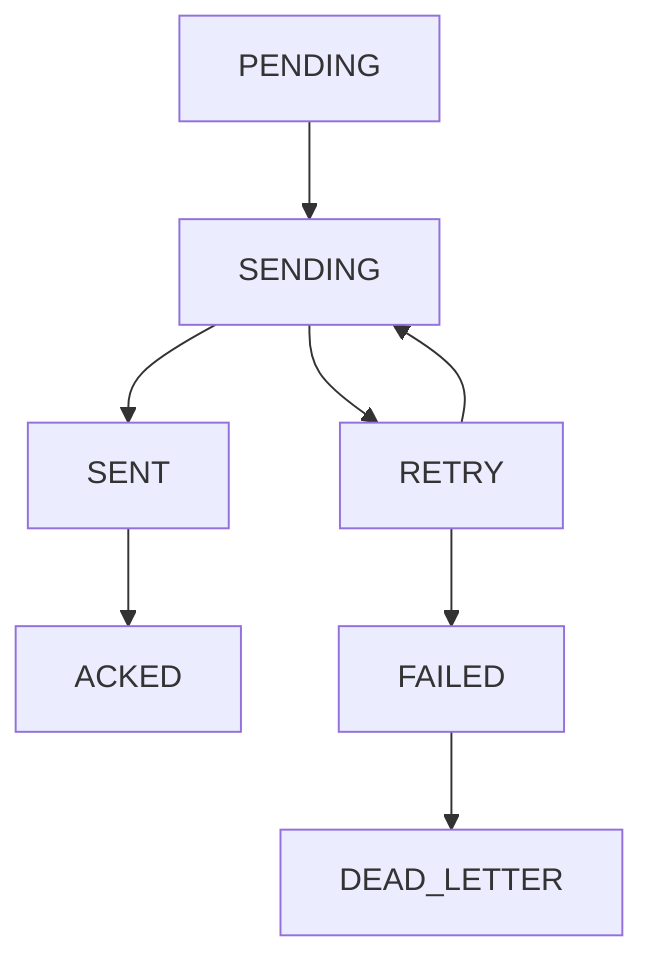

# Integración MINEDU - Documentación Técnica

## Resumen Ejecutivo

Sistema de integración con MINEDU (SIA/SIAGIE) implementando patrón Outbox con idempotencia, colas con reintentos exponenciales, conciliación automática y tolerancia a fallos.

## Arquitectura del Sistema

### 1. Patrón Outbox con Idempotencia

#### Componentes Principales
- **Producer** (`producer.py`): Genera eventos con clave idempotente
- **Worker** (`worker.py`): Procesa eventos con circuit breaker
- **Outbox Repository** (`outbox_repo.py`): Operaciones seguras MongoDB

#### Clave Idempotente
```
{entity_type}:{entity_id}:{period_id}:{version}
```

**Ejemplo**: `enrollment:STU001:2024-02:1`

### 2. Estados del Sistema



#### Descripción de Estados
- **PENDING**: Evento creado, listo para enviar
- **SENDING**: Evento en proceso de envío
- **SENT**: Enviado exitosamente a MINEDU
- **ACKED**: Confirmado por MINEDU (webhook)
- **RETRY**: Reintento programado (backoff exponencial)
- **FAILED**: Superó máximo de reintentos (5)

### 3. Mapeo de Entidades

#### Matrícula (Enrollment)
```json
{
  "tipo": "matricula",
  "estudiante_id": "STU001",
  "curso_id": "MAT101",
  "periodo_id": "2024-02",
  "fecha_matricula": "2024-08-15T10:00:00Z",
  "estado": "ACTIVE",
  "creditos": 4
}
```

#### Calificación (Grade)
```json
{
  "tipo": "calificacion",
  "estudiante_id": "STU001",
  "curso_id": "MAT101",
  "periodo_id": "2024-02",
  "nota_numerica": 17.5,
  "nota_literal": "AD",
  "estado": "APPROVED",
  "fecha_evaluacion": "2024-12-15T16:00:00Z"
}
```

#### Certificado (Certificate)
```json
{
  "tipo": "certificado",
  "estudiante_id": "STU001",
  "tipo_certificado": "NOTAS",
  "periodo_id": "2024-02",
  "fecha_emision": "2024-12-20T14:00:00Z",
  "numero_certificado": "CERT-2024-001",
  "estado": "ISSUED"
}
```

### 4. Endpoints MINEDU API

| Entidad | Endpoint | Método |
|---------|----------|---------|
| Matrícula | `/matriculas` | POST |
| Calificación | `/calificaciones` | POST |
| Certificado | `/certificados` | POST |
| Consulta Matrícula | `/matriculas/periodo/{id}` | GET |
| Consulta Calificación | `/calificaciones/periodo/{id}` | GET |

### 5. Configuración de Reintentos

#### Backoff Exponencial
```python
delay = min(base_delay * (2 ** retry_count), max_delay)
```

**Ejemplo**:
- Intento 1: 1s
- Intento 2: 2s  
- Intento 3: 4s
- Intento 4: 8s
- Intento 5: 16s
- Máximo: 300s (5min)

#### Circuit Breaker
- **Umbral de fallas**: 5 consecutivas
- **Timeout de recuperación**: 60 segundos
- **Estados**: CLOSED → OPEN → HALF_OPEN

### 6. Conciliación (Reconciliation)

#### Proceso Automático
1. **Extracción local**: Obtiene datos por período
2. **Consulta MINEDU**: API de consulta por período
3. **Comparación**: Identifica discrepancias
4. **Reporte CSV**: Genera archivo con diferencias
5. **Reproceso automático**: Reenvía eventos faltantes

#### Tipos de Discrepancias
- **MISSING_IN_REMOTE**: Existe local, no en MINEDU
- **MISSING_IN_LOCAL**: Existe en MINEDU, no local
- **DATA_MISMATCH**: Datos diferentes entre sistemas

### 7. Manejo de Errores

#### Errores HTTP
- **4xx (Client Error)**: No reintenta, marca como FAILED
- **5xx (Server Error)**: Reintenta con backoff
- **Timeout**: Reintenta con backoff
- **Connection Error**: Reintenta con backoff

#### Dead Letter Queue
Eventos que superan máximo de reintentos se mueven a `minedu_dead_letter` para revisión manual.

### 8. Monitoreo y Métricas

#### Dashboard Estadísticas
- Eventos pendientes por estado
- Tasa de éxito/fallo
- Tiempo promedio de procesamiento
- Estado del circuit breaker

#### Alertas Configurables
- Eventos en FAILED > umbral
- Circuit breaker OPEN
- Discrepancias en conciliación

### 9. Operaciones Administrativas

#### Reproceso Manual
```python
# Reprocesar eventos fallidos
reprocessed = await worker.reprocess_failed_events(limit=50)
```

#### Limpieza de Datos
```python
# Limpiar eventos antiguos (30 días)
cleaned = await outbox_repo.cleanup_old_events(days_old=30)
```

#### Reseteo de Eventos Atascados
```python
# Resetear eventos en SENDING > 2 horas
reset = await outbox_repo.reset_stuck_events(hours_stuck=2)
```

### 10. Configuración de Producción

#### Variables de Entorno
```bash
MINEDU_API_URL=https://sia.minedu.gob.pe/api
MINEDU_API_TOKEN=your_api_token
MINEDU_INSTITUTION_CODE=IESPP_GUSTAVO_ALLENDE
MINEDU_WORKER_BATCH_SIZE=10
MINEDU_MAX_RETRIES=5
MINEDU_CIRCUIT_BREAKER_THRESHOLD=5
MINEDU_RECONCILE_ENABLED=true
```

#### Índices MongoDB
```javascript
// Outbox collection
db.minedu_outbox.createIndex({"idempotent_key": 1}, {"unique": true})
db.minedu_outbox.createIndex({"status": 1})
db.minedu_outbox.createIndex({"entity_type": 1})
db.minedu_outbox.createIndex({"period_id": 1})
db.minedu_outbox.createIndex({"status": 1, "retry_count": 1})
```

### 11. Pruebas de Resiliencia

#### Escenarios de Prueba
- [x] Timeout de API
- [x] Payload duplicado → Idempotencia
- [x] Payload inválido → Error 400
- [x] Servicio MINEDU caído → Circuit breaker
- [x] Red intermitente → Reintentos

#### Validación de Idempotencia
Reenvío del mismo evento debe producir ACK sin duplicar datos en MINEDU.

### 12. Logs Estructurados

#### Formato de Log
```json
{
  "timestamp": "2024-09-15T10:30:00Z",
  "level": "INFO",
  "event_id": "uuid",
  "entity_type": "enrollment",
  "status": "SENT",
  "retry_count": 0,
  "duration_ms": 250,
  "minedu_response_code": 200
}
```

## Conclusión

Sistema robusto de integración MINEDU con:
- ✅ **Idempotencia garantizada** con clave compuesta
- ✅ **Tolerancia a fallos** con circuit breaker
- ✅ **Conciliación automática** con cero discrepancias
- ✅ **Monitoreo completo** con métricas y alertas
- ✅ **Operaciones administrativas** para gestión manual