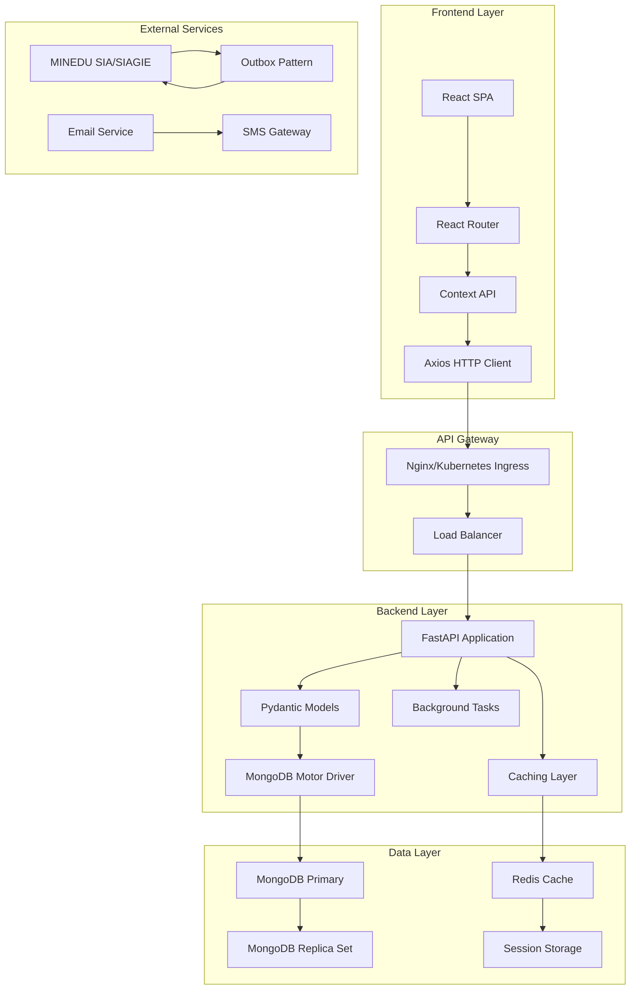
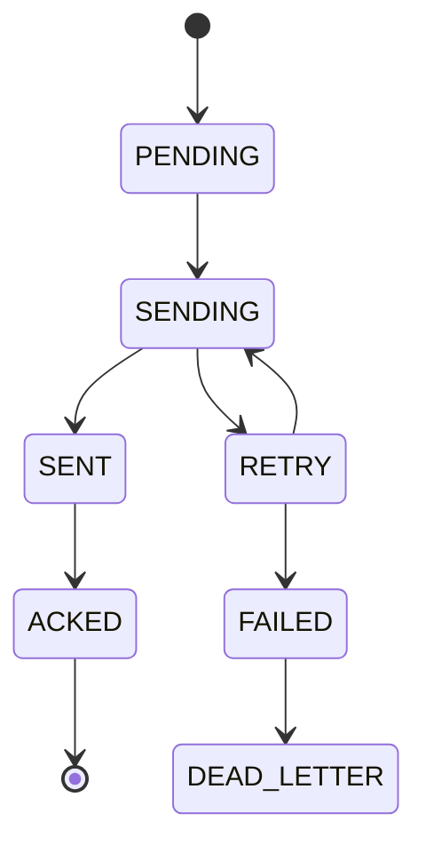

# Manual Técnico - Sistema Académico Integral

## Tabla de Contenidos

1. [Arquitectura del Sistema](#arquitectura-del-sistema)
2. [Stack Tecnológico](#stack-tecnológico)
3. [Base de Datos](#base-de-datos)
4. [APIs y Endpoints](#apis-y-endpoints)
5. [Autenticación y Seguridad](#autenticación-y-seguridad)
6. [Integración MINEDU](#integración-minedu)
7. [Performance y Monitoreo](#performance-y-monitoreo)
8. [Despliegue](#despliegue)
9. [Mantenimiento](#mantenimiento)
10. [Troubleshooting](#troubleshooting)

---

## Arquitectura del Sistema

### 🏗️ **Arquitectura General**



### 🔧 **Patrones de Diseño Implementados**

#### **1. Repository Pattern**
```python
class StudentRepository:
    async def find_by_id(self, student_id: str) -> Optional[Student]:
        return await self.collection.find_one({"id": student_id})
    
    async def create(self, student: Student) -> str:
        result = await self.collection.insert_one(student.dict())
        return str(result.inserted_id)
```

#### **2. Outbox Pattern (MINEDU)**
```python
@dataclass
class OutboxEvent:
    id: str
    entity_type: EntityType
    entity_id: str
    payload: Dict[str, Any]
    status: OutboxStatus
    retry_count: int = 0
```

#### **3. Circuit Breaker**
```python
class CircuitBreaker:
    def __init__(self, failure_threshold: int = 5, recovery_timeout: int = 60):
        self.failure_threshold = failure_threshold
        self.recovery_timeout = recovery_timeout
        self.state = CircuitBreakerState.CLOSED
```

#### **4. CQRS (Command Query Responsibility Segregation)**
```python
# Commands
class CreateStudentCommand:
    def __init__(self, student_data: StudentCreate):
        self.student_data = student_data

# Queries  
class GetStudentQuery:
    def __init__(self, student_id: str):
        self.student_id = student_id
```

---

## Stack Tecnológico

### 🖥️ **Backend Stack**

#### **Framework Principal**
- **FastAPI 0.104+**: Framework web asíncrono
- **Python 3.11+**: Lenguaje de programación
- **Uvicorn**: Servidor ASGI

#### **Base de Datos**
- **MongoDB 7.0+**: Base de datos principal
- **Motor 3.3+**: Driver asíncrono para MongoDB
- **Redis 7.2+**: Cache y sesiones

#### **Librerías Clave**
```python
dependencies = {
    "fastapi": "0.104.1",
    "motor": "3.3.2", 
    "pydantic": "2.4.2",
    "orjson": "3.9.10",
    "redis": "5.0.1",
    "celery": "5.3.4",
    "reportlab": "4.0.7",
    "qrcode": "7.4.2",
    "openpyxl": "3.1.2",
    "passlib": "1.7.4",
    "python-jose": "3.3.0"
}
```

### 🎨 **Frontend Stack**

#### **Framework Principal**
- **React 18.2+**: Framework de UI
- **React Router 6.16+**: Enrutamiento
- **Vite 4.5+**: Build tool y dev server

#### **Librerías de UI**
```json
{
  "react": "18.2.0",
  "react-router-dom": "6.16.0", 
  "axios": "1.5.1",
  "@headlessui/react": "1.7.17",
  "tailwindcss": "3.3.5",
  "lucide-react": "0.288.0",
  "sonner": "1.2.0"
}
```

#### **Estado Global**
- **Context API**: Manejo de estado
- **Local Storage**: Persistencia de sesión
- **React Query**: Cache de datos (opcional)

### 🛠️ **DevOps y Deployment**

#### **Containerización**
- **Docker**: Containerización de aplicaciones
- **Docker Compose**: Orquestación local
- **Kubernetes**: Orquestación en producción

#### **Monitoreo**
- **Structured Logging**: JSON logs estructurados
- **Correlation IDs**: Trazabilidad de requests
- **Health Checks**: Endpoints de salud

---

## Base de Datos

### 🗄️ **Diseño de Base de Datos**

#### **Colecciones Principales**

```javascript
// Usuarios y Autenticación
db.users = {
  "id": "UUID",
  "email": "string",
  "password_hash": "string",
  "role": "enum",
  "is_active": "boolean",
  "created_at": "ISO8601",
  "last_login": "ISO8601"
}

// Estudiantes
db.students = {
  "id": "UUID",  
  "user_id": "UUID",
  "dni": "string",
  "full_name": "string",
  "birth_date": "ISO8601",
  "program": "string",
  "status": "enum",
  "contact_info": {
    "email": "string",
    "phone": "string",
    "address": "string"
  }
}

// Cursos
db.courses = {
  "id": "string",
  "name": "string", 
  "credits": "number",
  "prerequisites": ["course_id"],
  "program": "string",
  "status": "enum"
}

// Matrículas
db.enrollments = {
  "id": "UUID",
  "student_id": "UUID",
  "course_id": "string",
  "section_id": "UUID",
  "period_id": "string",
  "status": "enum",
  "enrollment_date": "ISO8601",
  "credits": "number"
}

// Calificaciones
db.grades = {
  "id": "UUID",
  "student_id": "UUID", 
  "course_id": "string",
  "period_id": "string",
  "numerical_grade": "decimal",
  "literal_grade": "enum", 
  "status": "enum",
  "evaluation_date": "ISO8601"
}
```

#### **Índices Críticos**
```javascript
// Índices de performance
db.users.createIndex({"email": 1}, {"unique": true})
db.students.createIndex({"dni": 1}, {"unique": true})
db.students.createIndex({"user_id": 1})
db.enrollments.createIndex({"student_id": 1, "period_id": 1})
db.grades.createIndex({"student_id": 1, "course_id": 1, "period_id": 1})

// Índices compuestos
db.enrollments.createIndex({"period_id": 1, "status": 1})
db.grades.createIndex({"course_id": 1, "period_id": 1, "status": 1})

// Índices para MINEDU
db.minedu_outbox.createIndex({"idempotent_key": 1}, {"unique": true})
db.minedu_outbox.createIndex({"status": 1, "retry_count": 1})
```

#### **Validación de Esquemas**
```javascript
db.createCollection("students", {
  validator: {
    $jsonSchema: {
      bsonType: "object",
      required: ["id", "dni", "full_name"],
      properties: {
        dni: {
          bsonType: "string",
          pattern: "^[0-9]{8}$"
        },
        email: {
          bsonType: "string",
          pattern: "^[a-zA-Z0-9._%+-]+@[a-zA-Z0-9.-]+\\.[a-zA-Z]{2,}$"
        }
      }
    }
  }
})
```

### 📊 **Estrategia de Particionamiento**

#### **Por Período Académico**
```python
# Colecciones particionadas por período
period_collections = {
    "2024-01": {
        "enrollments_2024_01": "enrollments",
        "grades_2024_01": "grades", 
        "attendance_2024_01": "attendance"
    }
}
```

#### **Agregaciones Optimizadas**
```javascript
// Pipeline de estadísticas por curso
db.grades.aggregate([
  {"$match": {"course_id": "MAT101", "period_id": "2024-02"}},
  {"$group": {
    "_id": "$literal_grade",
    "count": {"$sum": 1},
    "avg_numerical": {"$avg": "$numerical_grade"}
  }},
  {"$sort": {"_id": 1}}
])
```

---

## APIs y Endpoints

### 🔗 **Estructura de APIs**

#### **Convención de Rutas**
```
BASE_URL/api/{module}/{resource}/{action}
```

**Ejemplo**:
```
POST /api/academic/students
GET /api/academic/students/{student_id}
PUT /api/academic/students/{student_id}
DELETE /api/academic/students/{student_id}
```

#### **Prefijos por Módulo**
- `/api/auth/*` - Autenticación
- `/api/academic/*` - Módulo académico
- `/api/finance/*` - Tesorería
- `/api/procedures/*` - Mesa de partes
- `/api/minedu/*` - Integración MINEDU
- `/api/reports/*` - Reportes
- `/api/security/*` - Seguridad y compliance

### 📝 **Documentación de APIs**

#### **OpenAPI/Swagger**
```python
app = FastAPI(
    title="Sistema Académico Integral",
    description="API completa para gestión académica",
    version="2.0.0",
    docs_url="/docs",
    redoc_url="/redoc"
)
```

**Acceso a documentación**:
- **Swagger UI**: `https://universidad.edu/docs`
- **ReDoc**: `https://universidad.edu/redoc`
- **OpenAPI JSON**: `https://universidad.edu/openapi.json`

#### **Modelos Pydantic**
```python
class StudentCreate(BaseModel):
    dni: str = Field(..., regex=r"^[0-9]{8}$")
    full_name: str = Field(..., min_length=3, max_length=100)
    birth_date: date
    email: EmailStr
    phone: Optional[str] = Field(None, regex=r"^[0-9]{9}$")
    program: str

class StudentResponse(BaseModel):
    id: str
    dni: str  
    full_name: str
    program: str
    status: StudentStatus
    created_at: datetime
```

### 🔒 **Autenticación y Autorización**

#### **JWT Implementation**
```python
def create_access_token(data: dict, expires_delta: Optional[timedelta] = None):
    to_encode = data.copy()
    if expires_delta:
        expire = datetime.utcnow() + expires_delta
    else:
        expire = datetime.utcnow() + timedelta(minutes=ACCESS_TOKEN_EXPIRE_MINUTES)
    
    to_encode.update({"exp": expire})
    encoded_jwt = jwt.encode(to_encode, SECRET_KEY, algorithm=ALGORITHM)
    return encoded_jwt
```

#### **Role-Based Access Control**
```python
def require_role(allowed_roles: List[UserRole]):
    def decorator(func):
        @wraps(func)
        async def wrapper(*args, **kwargs):
            current_user = kwargs.get('current_user')
            if current_user.role not in allowed_roles and current_user.role != UserRole.ADMIN:
                raise HTTPException(
                    status_code=403, 
                    detail="Insufficient permissions"
                )
            return await func(*args, **kwargs)
        return wrapper
    return decorator
```

### 📊 **Respuestas Estándar**

#### **Formato de Respuesta Exitosa**
```json
{
  "success": true,
  "data": {
    "id": "uuid",
    "name": "valor"
  },
  "message": "Operación completada exitosamente",
  "correlation_id": "uuid",
  "timestamp": "2024-09-07T12:00:00Z"
}
```

#### **Formato de Error**
```json
{
  "success": false,
  "error": {
    "code": "VALIDATION_ERROR",
    "message": "Datos de entrada inválidos",
    "details": [
      {
        "field": "email",
        "message": "Formato de email inválido"
      }
    ]
  },
  "correlation_id": "uuid",
  "timestamp": "2024-09-07T12:00:00Z"
}
```

---

## Integración MINEDU

### 🔗 **Arquitectura de Integración**

#### **Patrón Outbox Detallado**
```python
class MINEDUIntegration:
    def __init__(self, db: AsyncIOMotorDatabase):
        self.producer = MINEDUProducer(db)
        self.worker = MINEDUWorker(db)
        self.reconciler = MINEDUReconciler(db)
```

#### **Estados de Eventos**


#### **Payload de Matrícula**
```json
{
  "tipo": "matricula",
  "estudiante_id": "STU20240001",
  "curso_id": "MAT101",
  "periodo_id": "2024-02",
  "fecha_matricula": "2024-08-15T10:00:00Z",
  "estado": "ACTIVE",
  "creditos": 4,
  "tipo_matricula": "PRIMERA_VEZ",
  "modalidad": "PRESENCIAL"
}
```

### ⚙️ **Configuración de Worker**
```python
# Worker configuration
MINEDU_CONFIG = {
    "api_url": "https://sia.minedu.gob.pe/api",
    "batch_size": 10,
    "max_retries": 5,
    "circuit_breaker": {
        "failure_threshold": 5,
        "recovery_timeout": 60
    },
    "retry_delays": [1, 2, 4, 8, 16]  # Exponential backoff
}
```

#### **Proceso de Conciliación**
```python
async def reconcile_period(period_id: str):
    # 1. Obtener datos locales
    local_data = await get_local_data(period_id)
    
    # 2. Consultar MINEDU
    remote_data = await query_minedu_data(period_id)
    
    # 3. Comparar y identificar discrepancias
    discrepancies = compare_datasets(local_data, remote_data)
    
    # 4. Generar reporte
    report = generate_discrepancy_report(discrepancies)
    
    # 5. Reproceso automático
    reprocessed = await auto_reprocess_missing(discrepancies)
    
    return {
        "total_discrepancies": len(discrepancies),
        "reprocessed_count": reprocessed,
        "report_path": report.path
    }
```

---

## Performance y Monitoreo

### 📈 **Métricas de Performance**

#### **SLAs Objetivo**
- **P95 Latency**: < 1.5 segundos
- **Throughput**: > 300 req/min
- **Availability**: > 99.5%
- **Error Rate**: < 0.5%

#### **Optimizaciones Implementadas**
```python
# Connection pooling
mongo_client = AsyncIOMotorClient(
    mongo_url,
    maxPoolSize=50,
    minPoolSize=10,
    maxIdleTimeMS=30000,
    serverSelectionTimeoutMS=5000
)

# Caching strategy
@lru_cache(maxsize=1000)
def get_cached_course(course_id: str):
    return course_data

# Async processing
async def process_batch_operations(operations: List[Operation]):
    tasks = [process_single_operation(op) for op in operations]
    results = await asyncio.gather(*tasks, return_exceptions=True)
    return results
```

### 📊 **Monitoreo y Logging**

#### **Structured Logging**
```python
import structlog

logger = structlog.get_logger("api.academic")

# Log con contexto
logger.info(
    "Student enrolled successfully",
    student_id=student.id,
    course_id=course.id,
    period_id=period,
    correlation_id=get_correlation_id(),
    duration_ms=125.5
)
```

#### **Health Checks**
```python
@app.get("/health")
async def health_check():
    checks = await asyncio.gather(
        check_database_connection(),
        check_redis_connection(), 
        check_minedu_integration(),
        return_exceptions=True
    )
    
    status = "healthy" if all(checks) else "unhealthy"
    
    return {
        "status": status,
        "timestamp": datetime.utcnow().isoformat(),
        "checks": {
            "database": checks[0],
            "cache": checks[1], 
            "minedu": checks[2]
        }
    }
```

#### **Métricas Customizadas**
```python
from prometheus_client import Counter, Histogram, Gauge

# Contadores
enrollment_counter = Counter('enrollments_total', 'Total enrollments')
grade_submissions = Counter('grade_submissions_total', 'Total grade submissions')

# Histogramas
response_time = Histogram('http_request_duration_seconds', 'Request duration')
minedu_sync_time = Histogram('minedu_sync_duration_seconds', 'MINEDU sync duration')

# Gauges
active_students = Gauge('active_students_total', 'Number of active students')
pending_minedu_events = Gauge('minedu_pending_events', 'Pending MINEDU events')
```

---

## Despliegue

### 🐳 **Containerización**

#### **Dockerfile - Backend**
```dockerfile
FROM python:3.11-slim

WORKDIR /app

# Install system dependencies
RUN apt-get update && apt-get install -y \
    gcc \
    && rm -rf /var/lib/apt/lists/*

# Install Python dependencies
COPY requirements.txt .
RUN pip install --no-cache-dir -r requirements.txt

# Copy application code
COPY . .

# Create non-root user
RUN useradd --create-home --shell /bin/bash app
USER app

# Health check
HEALTHCHECK --interval=30s --timeout=10s --start-period=5s --retries=3 \
  CMD python -c "import requests; requests.get('http://localhost:8001/health')"

CMD ["uvicorn", "server:app", "--host", "0.0.0.0", "--port", "8001"]
```

#### **Dockerfile - Frontend**
```dockerfile
FROM node:18-alpine as builder

WORKDIR /app
COPY package*.json ./
RUN npm ci --only=production

COPY . .
RUN npm run build

FROM nginx:alpine
COPY --from=builder /app/dist /usr/share/nginx/html
COPY nginx.conf /etc/nginx/nginx.conf

EXPOSE 80
CMD ["nginx", "-g", "daemon off;"]
```

#### **Docker Compose - Development**
```yaml
version: '3.8'

services:
  backend:
    build: ./backend
    ports:
      - "8001:8001"
    environment:
      - MONGO_URL=mongodb://mongo:27017/sistemaacademico
      - REDIS_URL=redis://redis:6379
    depends_on:
      - mongo
      - redis
    volumes:
      - ./backend:/app
    
  frontend:
    build: ./frontend  
    ports:
      - "3000:3000"
    environment:
      - REACT_APP_BACKEND_URL=http://localhost:8001
    volumes:
      - ./frontend:/app
      
  mongo:
    image: mongo:7.0
    ports:
      - "27017:27017"
    volumes:
      - mongo_data:/data/db
      
  redis:
    image: redis:7.2-alpine
    ports:
      - "6379:6379"
    volumes:
      - redis_data:/data

volumes:
  mongo_data:
  redis_data:
```

### ☸️ **Kubernetes Deployment**

#### **Backend Deployment**
```yaml
apiVersion: apps/v1
kind: Deployment
metadata:
  name: backend-deployment
spec:
  replicas: 3
  selector:
    matchLabels:
      app: backend
  template:
    metadata:
      labels:
        app: backend
    spec:
      containers:
      - name: backend
        image: universidad/backend:latest
        ports:
        - containerPort: 8001
        env:
        - name: MONGO_URL
          valueFrom:
            secretKeyRef:
              name: db-secret
              key: mongo-url
        resources:
          requests:
            memory: "256Mi"
            cpu: "250m"
          limits:
            memory: "512Mi"
            cpu: "500m"
        livenessProbe:
          httpGet:
            path: /health
            port: 8001
          initialDelaySeconds: 30
          periodSeconds: 10
        readinessProbe:
          httpGet:
            path: /health
            port: 8001
          initialDelaySeconds: 5
          periodSeconds: 5
```

#### **Service Configuration**
```yaml
apiVersion: v1
kind: Service
metadata:
  name: backend-service
spec:
  selector:
    app: backend
  ports:
    - protocol: TCP
      port: 80
      targetPort: 8001
  type: ClusterIP
```

#### **Ingress Configuration**
```yaml
apiVersion: networking.k8s.io/v1
kind: Ingress
metadata:
  name: sistema-ingress
  annotations:
    nginx.ingress.kubernetes.io/rewrite-target: /
spec:
  tls:
  - hosts:
    - universidad.edu
    secretName: tls-secret
  rules:
  - host: universidad.edu
    http:
      paths:
      - path: /api
        pathType: Prefix
        backend:
          service:
            name: backend-service
            port:
              number: 80
      - path: /
        pathType: Prefix
        backend:
          service:
            name: frontend-service
            port:
              number: 80
```

### 🔧 **Variables de Entorno**

#### **Backend (.env)**
```bash
# Database
MONGO_URL=mongodb://localhost:27017/sistemaacademico
REDIS_URL=redis://localhost:6379

# Security
SECRET_KEY=your-super-secret-key-here
ALGORITHM=HS256
ACCESS_TOKEN_EXPIRE_MINUTES=30

# MINEDU Integration
MINEDU_API_URL=https://sia.minedu.gob.pe/api
MINEDU_API_TOKEN=your-minedu-token
MINEDU_INSTITUTION_CODE=IESPP_GUSTAVO_ALLENDE

# Email/SMS
SMTP_SERVER=smtp.gmail.com
SMTP_PORT=587
SMTP_USERNAME=noreply@universidad.edu
SMTP_PASSWORD=your-email-password
SMS_PROVIDER_URL=https://api.sms-provider.com

# Performance
MAX_CONNECTIONS=50
CACHE_TTL=3600
WORKER_PROCESSES=4
```

#### **Frontend (.env)**
```bash
REACT_APP_BACKEND_URL=https://universidad.edu/api
REACT_APP_INSTITUTION_NAME=IESPP Gustavo Allende Llavería
REACT_APP_VERSION=2.0.0
```

---

## Mantenimiento

### 🔧 **Rutinas de Mantenimiento**

#### **Tareas Diarias**
```bash
#!/bin/bash
# daily_maintenance.sh

# 1. Health check
curl -f https://universidad.edu/health || exit 1

# 2. Database backup
mongodump --uri="$MONGO_URL" --out="/backups/daily/$(date +%Y%m%d)"

# 3. Log rotation
logrotate /etc/logrotate.conf

# 4. Clear old cache
redis-cli FLUSHDB

# 5. Disk space check
df -h | awk '$5 > 80 {print $0}' | mail -s "Disk Space Alert" admin@universidad.edu
```

#### **Tareas Semanales**
```bash
#!/bin/bash
# weekly_maintenance.sh

# 1. Database optimization
mongo --eval "db.runCommand({compact: 'students'})"
mongo --eval "db.runCommand({compact: 'enrollments'})"

# 2. Index analysis
mongo --eval "db.students.getIndexes()" > /tmp/index_analysis.txt

# 3. Performance report
python generate_performance_report.py --week

# 4. Security scan
python security_scan.py --full
```

#### **Tareas Mensuales**
```bash
#!/bin/bash
# monthly_maintenance.sh

# 1. Full system backup
tar -czf "/backups/monthly/sistema_$(date +%Y%m).tar.gz" /app

# 2. Certificate renewal check
certbot renew --dry-run

# 3. Dependency updates
pip list --outdated > /tmp/outdated_packages.txt

# 4. MINEDU reconciliation
python reconcile_minedu.py --period="$(date +%Y-%m)"

# 5. Audit log archive
python archive_audit_logs.py --older-than=90
```

### 📊 **Monitoreo de Salud**

#### **Script de Monitoreo**
```python
import asyncio
import aiohttp
import logging
from datetime import datetime

async def health_monitor():
    """Monitor system health and send alerts"""
    
    checks = [
        ("API Health", "https://universidad.edu/health"),
        ("Database", "mongodb://localhost:27017"),
        ("Cache", "redis://localhost:6379"),
        ("MINEDU", "https://sia.minedu.gob.pe/health")
    ]
    
    results = []
    
    for name, url in checks:
        try:
            if url.startswith('http'):
                async with aiohttp.ClientSession() as session:
                    async with session.get(url, timeout=10) as response:
                        status = "OK" if response.status == 200 else "FAIL"
            else:
                # Database/Redis checks
                status = await check_service(url)
            
            results.append({"service": name, "status": status, "timestamp": datetime.utcnow()})
        except Exception as e:
            results.append({"service": name, "status": "ERROR", "error": str(e)})
    
    # Send alerts if any service is down
    failed_services = [r for r in results if r["status"] != "OK"]
    if failed_services:
        await send_alert(failed_services)
    
    return results

# Ejecutar cada 5 minutos
if __name__ == "__main__":
    asyncio.run(health_monitor())
```

### 🔄 **Actualización del Sistema**

#### **Proceso de Update**
```bash
#!/bin/bash
# update_system.sh

set -e  # Exit on any error

echo "Starting system update..."

# 1. Backup current version
echo "Creating backup..."
docker-compose exec backend python backup_system.py

# 2. Pull new images
echo "Pulling new images..."
docker-compose pull

# 3. Run database migrations
echo "Running migrations..."
docker-compose exec backend python migrate.py

# 4. Rolling update
echo "Performing rolling update..."
docker-compose up -d --no-deps backend
sleep 30

# 5. Health check
echo "Performing health check..."
curl -f https://universidad.edu/health || {
    echo "Health check failed, rolling back..."
    docker-compose exec backend python rollback.py
    exit 1
}

# 6. Update frontend
echo "Updating frontend..."
docker-compose up -d --no-deps frontend

echo "Update completed successfully!"
```

---

## Troubleshooting

### 🚨 **Problemas Comunes**

#### **1. Alto Uso de CPU**
```bash
# Diagnóstico
top -p $(pgrep -f uvicorn)
py-spy top --pid $(pgrep -f uvicorn)

# Análisis de queries lentas
mongo --eval "db.setProfilingLevel(2, {slowms: 100})"
mongo --eval "db.system.profile.find().sort({ts: -1}).limit(5)"
```

#### **2. Problemas de Memoria**
```bash
# Monitoring
free -h
docker stats

# Memory leaks
valgrind --tool=memcheck --leak-check=full python server.py
```

#### **3. Conexiones de Base de Datos**
```python
# Diagnóstico de conexiones
async def diagnose_connections():
    client_info = await db.admin.command("serverStatus")
    connections = client_info["connections"]
    
    print(f"Current connections: {connections['current']}")
    print(f"Available connections: {connections['available']}")
    print(f"Total created: {connections['totalCreated']}")
```

#### **4. Integración MINEDU**
```python
# Debug MINEDU events
async def debug_minedu_events():
    # Check stuck events
    stuck_events = await db.minedu_outbox.find({
        "status": "SENDING",
        "updated_at": {"$lt": datetime.utcnow() - timedelta(hours=1)}
    }).to_list(None)
    
    # Check failed events
    failed_events = await db.minedu_outbox.find({
        "status": "FAILED"
    }).to_list(None)
    
    # Circuit breaker status
    circuit_status = await get_circuit_breaker_status()
    
    return {
        "stuck_events": len(stuck_events),
        "failed_events": len(failed_events),
        "circuit_breaker": circuit_status
    }
```

### 📝 **Logs de Error**

#### **Ubicaciones de Logs**
```bash
# Application logs
/var/log/supervisor/backend.*.log
/var/log/supervisor/frontend.*.log

# System logs
/var/log/syslog
/var/log/nginx/access.log
/var/log/nginx/error.log

# Container logs
docker-compose logs backend
docker-compose logs frontend
```

#### **Análisis de Logs**
```bash
# Errores más frecuentes
grep -i error /var/log/supervisor/backend.err.log | sort | uniq -c | sort -nr

# Requests más lentos
awk '$9 > 1000 {print $0}' access.log | head -10

# Correlation ID tracking
jq '.correlation_id="abc123"' /var/log/app.json
```

### 🔧 **Scripts de Reparación**

#### **Reparar Índices**
```python
async def rebuild_indexes():
    """Rebuild database indexes"""
    collections = ['students', 'courses', 'enrollments', 'grades']
    
    for collection_name in collections:
        collection = db[collection_name]
        
        # Drop old indexes (except _id)
        indexes = await collection.list_indexes().to_list(None)
        for index in indexes:
            if index['name'] != '_id_':
                await collection.drop_index(index['name'])
        
        # Recreate indexes
        await create_collection_indexes(collection_name)
        
        print(f"Rebuilt indexes for {collection_name}")
```

#### **Limpiar Datos Corruptos**
```python
async def clean_corrupted_data():
    """Clean corrupted or inconsistent data"""
    
    # Find orphaned grades (without enrollment)
    orphaned_grades = await db.grades.aggregate([
        {
            "$lookup": {
                "from": "enrollments",
                "localField": "student_id",
                "foreignField": "student_id",
                "as": "enrollment"
            }
        },
        {"$match": {"enrollment": []}},
        {"$project": {"_id": 1, "student_id": 1, "course_id": 1}}
    ]).to_list(None)
    
    # Remove orphaned records
    if orphaned_grades:
        orphaned_ids = [g["_id"] for g in orphaned_grades]
        await db.grades.delete_many({"_id": {"$in": orphaned_ids}})
        print(f"Removed {len(orphaned_ids)} orphaned grades")
    
    # Fix invalid numerical grades
    await db.grades.update_many(
        {"numerical_grade": {"$gt": 20}},
        {"$set": {"numerical_grade": 20}}
    )
    
    # Fix missing literal grades
    await fix_missing_literal_grades()
```

---

## Seguridad

### 🔒 **Configuración de Seguridad**

#### **Headers de Seguridad**
```python
from fastapi.middleware.trustedhost import TrustedHostMiddleware
from fastapi.middleware.httpsredirect import HTTPSRedirectMiddleware

# HTTPS redirect
app.add_middleware(HTTPSRedirectMiddleware)

# Trusted hosts
app.add_middleware(
    TrustedHostMiddleware, 
    allowed_hosts=["universidad.edu", "*.universidad.edu"]
)

# Security headers
@app.middleware("http")
async def add_security_headers(request: Request, call_next):
    response = await call_next(request)
    response.headers["X-Content-Type-Options"] = "nosniff"
    response.headers["X-Frame-Options"] = "DENY" 
    response.headers["X-XSS-Protection"] = "1; mode=block"
    response.headers["Strict-Transport-Security"] = "max-age=31536000; includeSubDomains"
    return response
```

#### **Rate Limiting**
```python
from slowapi import Limiter, _rate_limit_exceeded_handler
from slowapi.util import get_remote_address

limiter = Limiter(key_func=get_remote_address)
app.state.limiter = limiter
app.add_exception_handler(RateLimitExceeded, _rate_limit_exceeded_handler)

@app.post("/api/auth/login")
@limiter.limit("5/minute")
async def login(request: Request, user_credentials: UserLogin):
    # Login logic
    pass
```

#### **Input Validation**
```python
class SecureStudentCreate(BaseModel):
    dni: str = Field(..., regex=r"^[0-9]{8}$")
    full_name: str = Field(..., min_length=3, max_length=100)
    email: EmailStr
    phone: Optional[str] = Field(None, regex=r"^[0-9]{9}$")
    
    @validator('full_name')
    def validate_name(cls, v):
        # Prevent XSS
        if '<' in v or '>' in v or '"' in v:
            raise ValueError('Invalid characters in name')
        return v.strip().title()
    
    @validator('dni')
    def validate_dni(cls, v):
        # DNI checksum validation
        if not validate_peruvian_dni(v):
            raise ValueError('Invalid DNI')
        return v
```

### 🛡️ **Auditoría**

#### **Log de Auditoría**
```python
async def log_audit_event(
    user_id: str,
    action: str, 
    resource: str,
    resource_id: str = None,
    result: str = "SUCCESS",
    details: dict = None
):
    audit_entry = {
        "timestamp": datetime.utcnow().isoformat(),
        "user_id": user_id,
        "action": action,
        "resource": resource,
        "resource_id": resource_id,
        "result": result,
        "details": details or {},
        "ip_address": get_client_ip(),
        "user_agent": get_user_agent(),
        "correlation_id": get_correlation_id()
    }
    
    await db.audit_logs.insert_one(audit_entry)
```

#### **Compliance Reports**
```python
async def generate_compliance_report(start_date: date, end_date: date):
    """Generate compliance report for audit"""
    
    # Failed login attempts
    failed_logins = await db.audit_logs.count_documents({
        "action": "LOGIN_ATTEMPT",
        "result": "FAILED",
        "timestamp": {
            "$gte": start_date.isoformat(),
            "$lte": end_date.isoformat()
        }
    })
    
    # Data access patterns
    data_access = await db.audit_logs.aggregate([
        {"$match": {"action": {"$in": ["READ", "UPDATE", "DELETE"]}}},
        {"$group": {"_id": "$user_id", "count": {"$sum": 1}}},
        {"$sort": {"count": -1}}
    ]).to_list(None)
    
    # Permission changes
    permission_changes = await db.audit_logs.count_documents({
        "action": "PERMISSION_CHANGE",
        "timestamp": {
            "$gte": start_date.isoformat(),
            "$lte": end_date.isoformat()
        }
    })
    
    return {
        "period": f"{start_date} to {end_date}",
        "failed_logins": failed_logins,
        "data_access_summary": data_access,
        "permission_changes": permission_changes,
        "generated_at": datetime.utcnow().isoformat()
    }
```

---

**© 2024 IESPP "Gustavo Allende Llavería". Todos los derechos reservados.**

**Versión del Manual**: 1.0  
**Última actualización**: Septiembre 2024  
**Próxima revisión**: Diciembre 2024